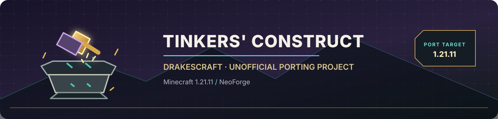

<p align="center">
  <a href="https://github.com/DrakesCraft-Labs/TinkersConstruct/tree/1.21.11">
    
  </a>
</p>

<h1 align="center">Tinkers' Construct · DrakesCraft Port</h1>
<p align="center"><b>A modern forge for Minecraft 1.21.11 & NeoForge</b><br>Unofficial monorepo port based on the original masterpieces by SlimeKnights.</p>

<p align="center">
  
  
  
  
  
  
</p>

<p align="center">
  <a href="PORTING_1.21.11.md">🛠️ Porting roadmap</a> ·
  <a href="modrinth-icon.svg">⬡ Modrinth icon</a> ·
  <a href="https://github.com/SlimeKnights/TinkersConstruct">↗ Upstream project</a>
</p>

---

> [!IMPORTANT]
> **Active Porting Workspace (`1.21.11` is now the default branch).**  
> This branch is an active engineering and migration environment for Minecraft 1.21.11 + NeoForge. It now packages **Mantle and Tinkers' Construct together in an all-in-one standalone architecture**.

---

## 💎 The Project

**Tinkers' Construct** is the legendary tool-building, weapon-forging, and material-customization mod created and maintained by **SlimeKnights**. 

This **DrakesCraft Labs** fork ports the complete experience to **Minecraft 1.21.11 + NeoForge 21.11.45**, preserving the beloved gameplay mechanics, recipes, fluid dynamics, modifiers, and identifiers while leveraging the modern Minecraft 21.11 internal APIs (`net.minecraft.resources.Identifier`, Data Components, Registries, and NeoForge Event Bus).

### ⚡ Key Architectural Highlights

* **📦 All-in-One Standalone Mod (Integrated Mantle):**  
  Mantle is now fully integrated directly into the Tinkers' Construct codebase as a unified monorepo. When built, it produces a single, self-contained JAR file.
* **🔌 Zero External Dependency Hassle:**  
  You do **not** need to search for, download, or match a separate Mantle JAR. Simply drop `TConstruct-1.21.11.jar` into your `mods/` directory.
* **🛡️ Full NeoForge Dual-Mod Declaration:**  
  The JAR declares both `[[mods]] modId="tconstruct"` and `[[mods]] modId="mantle"` inside `META-INF/neoforge.mods.toml`. NeoForge discovers and registers both mods cleanly at runtime.
* **📐 Complete API & Namespace Fidelity:**  
  All 594 Mantle classes remain in `slimeknights.mantle.*` and all Mantle assets in `assets/mantle/`. Third-party mods and internal systems expecting Mantle APIs continue to resolve them without breaking.

---

## 📊 Workstream Status

| Area / Workstream | Target Version | Current Status | Notes |
| :--- | :---: | :---: | :--- |
| **Default Branch** | `1.21.11` | ✅ **Live** | Configured as the primary default branch on GitHub |
| **Workspace & Toolchain** | NeoForge 21.11.45 | ✅ **Ready** | JDK 21, Gradle 9.2.1, NeoGradle 7.0.198 verified |
| **Mantle Integration** | Monorepo | ✅ **Completed** | Full source tree & assets embedded into single JAR |
| **AccessTransformers** | 1.21.11 | ✅ **Configured** | `Identifier` subclassing access transformer applied |
| **Base IDs & Core Utils** | 1.21.11 API | ✅ **Completed** | `IdParser`, `ResourceId`, `MaterialId`, `ModifierId`, `Util` migrated |
| **Registries & DeferredHolders** | NeoForge | 🔄 **In Progress** | Migrating Forge `RegistryObject` to `DeferredHolder` |
| **Item Data Components** | 1.21.11 Data | ⏳ **Queued** | Migrating NBT/Capabilities to modern Data Components |
| **Smeltery & Fluid Handlers** | NeoForge Capabilities | ⏳ **Queued** | NeoForge `IItemHandler` / `IFluidHandler` update |
| **Client Rendering & Book UI** | Modern Mojang Blit | ⏳ **Queued** | GuiGraphics and shader migration |

---

## 🏗️ Integrated Mantle Architecture

Historically, Tinkers' Construct required installing a companion library JAR called **Mantle**. In this 1.21.11 port, we adopt the same streamlined engineering design used in other DrakesCraft projects (such as *Fought* and *Core SF*):

```
TConstruct-1.21.11.jar (Single Distribution Artifact)
├── META-INF/
│   ├── neoforge.mods.toml  --> Declares BOTH 'tconstruct' and 'mantle'
│   └── accesstransformer.cfg
├── slimeknights/
│   ├── mantle/             --> Complete Mantle core library & utilities
│   └── tconstruct/          --> Tinkers' Construct mod logic & content
└── assets/
    ├── mantle/             --> Books, models, textures, animations
    └── tconstruct/         --> Full Tinkers' Construct resources
```

### Why this approach?
1. **Eliminates Version Desync:** Modpacks and server owners never run into mismatched library versions or missing dependencies during launch.
2. **Simplified CI/CD & Build Pipeline:** Everything builds in a single Gradle pass with unified mappings and shared AccessTransformers.
3. **Transparent Mod Loading:** NeoForge treats Mantle as fully present. Other mods that declare a dependency on Mantle will find it loaded and functional.

---

## 🛠️ Building From Source

### Requirements
* **Java Development Kit (JDK):** Version 21 (Temurin, OpenJDK, or GraalVM)
* **Gradle:** 9.2.1 (provided via `./gradlew` wrapper)
* **Memory:** Recommended minimum 4 GB RAM allocated to Gradle

### Build Commands

```bash
# Verify Gradle configuration and download NeoForge 21.11 dependencies
./gradlew tasks

# Compile sources (in active development)
./gradlew compileJava

# Build the complete standalone JAR
./gradlew build
```

---

## 📜 License, Attribution & Project Identity

* **Upstream Creation:** Tinkers' Construct and Mantle are created and maintained by **SlimeKnights**. Original upstream sources and resources are released under the [MIT License](LICENSE).
* **Port Leadership:** Maintained and ported by **JackStar6677-1** (`pablo.elias.miranda.292003@gmail.com`) for the **DrakesCraft Labs** ecosystem.
* **Original Artwork:** The custom animated `banner.svg` and `modrinth-icon.svg` visual assets were crafted by DrakesCraft Labs and licensed under MIT.
* **Disclaimer:** This is an independent, unofficial community port and is not affiliated with or endorsed by SlimeKnights. All original copyright notices and licenses have been strictly preserved.

<p align="center"><sub>Forged with passion & precision by DrakesCraft Labs · Standing on the shoulders of SlimeKnights</sub></p>
